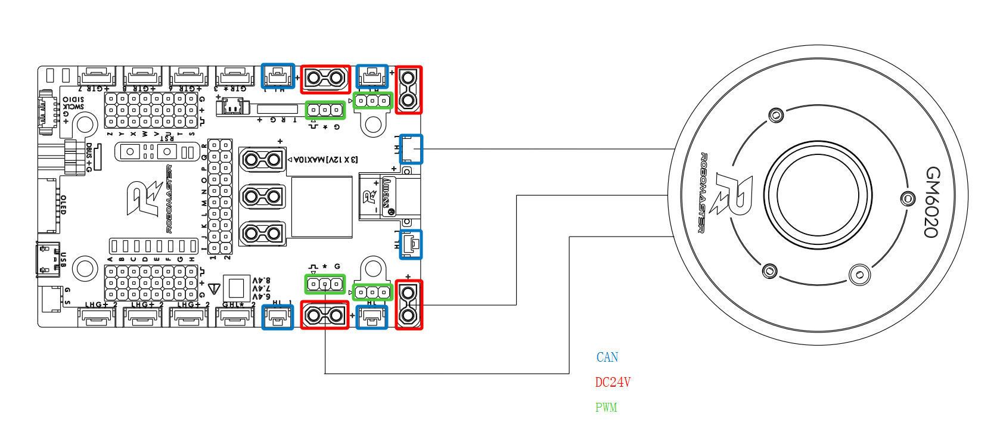
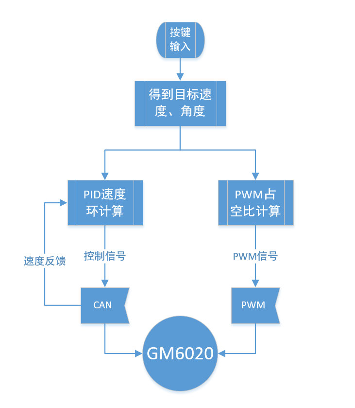

# GM6020 Demo Illustration

*version: 1.0* 

*date: 2023.06.14* 

##Development Platform

RoboMaster Development Board Type-A

STM32CubeMX

STM32CubeIDE

## Hardware Connection

* Connecting GM6020 Brushless DC Motor`s CAN、PWM and Power port with the development board`s CAN1、TIM1 and 24V controllable power supply output port respectively
* Connecting the development board with the power supply

## Download Method

* Using STM32CubeIDE open the project file and buil 'debug', file location("...\GM6020_demo.ioc)
* Using ST-Link run the project

##Software Function

- LED Status Indicator Light：Red light twinkling represent program is running, green light twinkling represent recieve feedback CAN message from the motor
- CAN and PWM control：The CAN output represents the calculated value of the position loop, which can control the motor to rotate to a pre-settled angle. The PWM signal can simulate the motor to operate in servo mode. The development board outputs both CAN and PWM signals, and the motor will prioritize responding to the CAN signal.
- User botton：When the user button on the development board is pressed, the motor with id 1's target angle will be rotating to 0°/360° (0/8191), and the motor with id 1's target angle will be rotating to 180° (4095). The PWM duty cycle will switch between 1080, 1290, 1500, and 1710 microseconds (corresponding to 0, 90, 180, and 270 degrees respectively in the default 360° servo mode).

## Code Flow Chart

